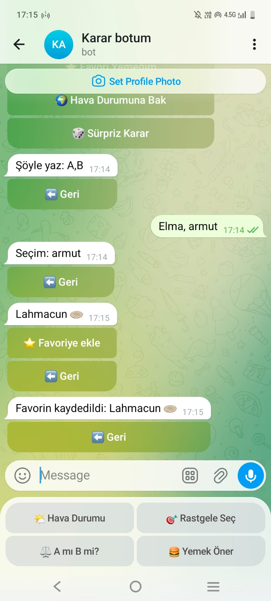
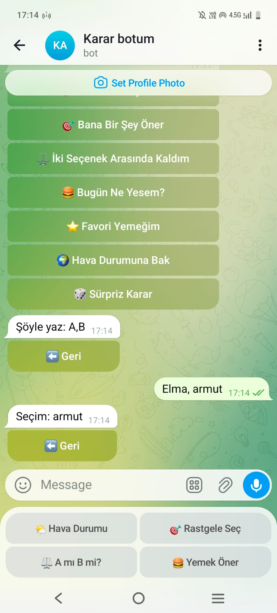

# 🤖 Telegram Karar Botu

Bu bot, kullanıcıların günlük hayatta karar vermesine yardımcı olmak için geliştirilmiştir.

---

## 🚀 Özellikler

* 🧠 Karar veremeyenler için öneriler
* 🎯 Rastgele aktivite seçimi
* ⚖️ İki seçenek arasında karar verme (A mı B mi)
* 🍔 Yemek önerisi
* ⭐ Favori yemek kaydetme sistemi
* 🌍 Hava durumu sorgulama
* 🎲 Sürpriz öneriler
* 👑 Admin paneli (kullanıcı sayısı görüntüleme)

---

## 🛠️ Kullanılan Teknolojiler

* Python
* python-telegram-bot
* OpenWeather API
* JSON veri saklama
* python-dotenv

---

## 📦 Kurulum

Projeyi bilgisayarına indir:

```bash
git clone https://github.com/kullaniciadi/projeadi.git
cd projeadi
```

Gerekli kütüphaneleri yükle:

```bash
pip install -r requirements.txt
```

---

## 🔐 .env Dosyası

Proje klasörüne `.env` dosyası oluştur:

```env
TOKEN=YOUR_BOT_TOKEN
API_KEY=YOUR_API_KEY
```

---

## ▶️ Çalıştırma

```bash
python bot.py
```

---

## 📁 Proje Yapısı

```text
telegram_bot/
│
├── handlers/
│   ├── hava.py
│   ├── karar.py
│   ├── admin.py
│   ├── yemek.py
│
├── utils/
│   ├── buttons.py
│
├── data/
│   ├── users.json
│
├── screenshots/
│   ├── anamenu.jpeg
│   ├── havadurumu.jpeg
│   ├── yemek önerisi.jpeg
│   ├── ikiseçenek arasında kaldım.jpeg
│   ├── admin panel.jpeg
│
├── .env
├── .gitignore
├── requirements.txt
├── README.md
└── bot.py
```

---

## 🔐 Güvenlik

Bu projede güvenlik nedeniyle:

* Telegram BOT TOKEN
* API KEY

gibi gizli bilgiler `.env` dosyasında tutulmaktadır.

---

## 👨‍💻 Geliştirici

Bu proje eğitim amaçlı geliştirilmiştir.

---

## 📸 Ekran Görüntüleri

### 🏠 Ana Menü


---

### 🌍 Hava Durumu


---

### 🍔 Yemek Önerisi



---

### ⚖️ Seçim Sistemi



---

### 👑 Admin Panel

