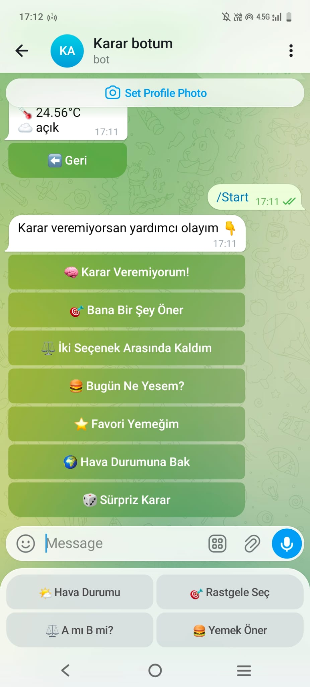
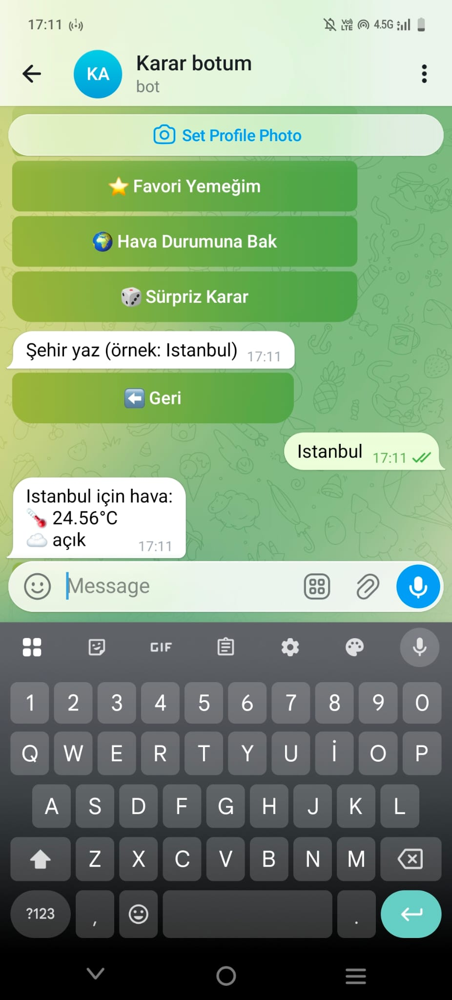
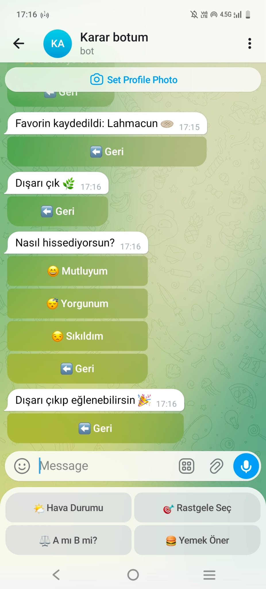

# 🤖 Telegram Karar Botu

Bu bot, kullanıcıların günlük hayatta karar vermesine yardımcı olmak için geliştirilmiştir.

Modern arayüzü, AI destekli tavsiye sistemi, kullanıcı profilleri ve admin paneli sayesinde gelişmiş bir Telegram asistanı olarak çalışır.

---

# 🚀 Özellikler

* 🧠 AI destekli tavsiye sistemi
* 🎯 Rastgele aktivite önerileri
* ⚖️ İki seçenek arasında karar verme (A mı B mi)
* 🍔 Yemek öneri sistemi
* ⭐ Favori yemek kaydetme
* 👤 Kullanıcı profil sistemi
* 🌍 Hava durumu sorgulama
* 🎲 Sürpriz karar sistemi
* 👑 Gelişmiş admin paneli
* 📢 Tüm kullanıcılara duyuru sistemi
* 🗄️ SQLite veritabanı sistemi
* 🔒 Güvenli .env sistemi
* 📊 Kullanıcı istatistikleri
* 🧠 Buton destekli AI tavsiye sistemi

---

# 🛠️ Kullanılan Teknolojiler

* Python
* python-telegram-bot
* SQLite3
* OpenWeather API
* python-dotenv

---

# 📦 Kurulum

Projeyi bilgisayarına indir:

```bash
git clone https://github.com/urukaysenur25-cmyk/telegram-karar-botu.git
cd telegram-karar-botu
```

Gerekli kütüphaneleri yükle:

```bash
pip install -r requirements.txt
```

---

# 🔐 .env Dosyası

Proje klasörüne `.env` dosyası oluştur:

```env
TOKEN=YOUR_BOT_TOKEN
API_KEY=YOUR_API_KEY
```

---

# ▶️ Çalıştırma

```bash
python bot.py
```

---

# 📁 Proje Yapısı

```text
telegram_bot/
│
├── handlers/
│   ├── hava.py
│   ├── karar.py
│   ├── admin.py
│   ├── yemek.py
│
├── utils/
│   ├── buttons.py
│
├── screenshots/
│   ├── menu.jpeg
│   ├── hava.jpeg
│   ├── yemek.jpeg
│   ├── secim.jpeg
│   ├── admin.jpeg
│
├── database.db
├── .env
├── .gitignore
├── requirements.txt
├── README.md
└── bot.py
```

---

# 👤 Kullanıcı Komutları

| Komut | Açıklama |
|---|---|
| `/start` | Botu başlatır |
| `/profil` | Kullanıcı profilini gösterir |
| `/id` | Kullanıcı ID bilgisini gösterir |

---

# 👑 Admin Komutları

| Komut | Açıklama |
|---|---|
| `/admin` | Admin panelini açar |
| `/duyuru` | Tüm kullanıcılara mesaj gönderir |

---

# 🧠 AI Tavsiye Sistemi

Bot kullanıcı ruh haline göre tavsiye verebilir.

Örnek kategoriler:

* 😢 Mutsuzum
* 😰 Stresliyim
* 😴 Yorgunum
* 😒 Sıkıldım
* ⚖️ Kararsızım
* 😔 Yalnızım
* 📚 Sınav stresim var

---

# 🔐 Güvenlik

Bu projede güvenlik nedeniyle:

* Telegram BOT TOKEN
* API KEY

gibi gizli bilgiler `.env` dosyasında tutulmaktadır.

---

# 👨‍💻 Geliştirici

Bu proje eğitim amaçlı geliştirilmiştir.

---

# 📸 Ekran Görüntüleri

## 🏠 Ana Menü



---

## 🌍 Hava Durumu



---

## 🍔 Yemek Önerisi


---

## ⚖️ Seçim Sistemi


---

## 👑 Admin Panel

